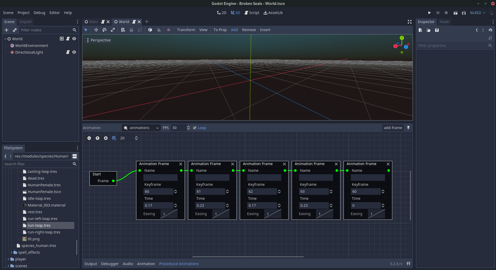

# Procedural Animations

This is a c++ engine module for the Godot engine.

It lets you compose new animations from other animation frames, and it alo sets up interpolations between them.

It comes with it's own editor plugin.



It was inspired by this talk:
https://www.youtube.com/watch?v=LNidsMesxSE

It does not do everything from the talk!

It supports both godot 3.2 and 4.0 (master). Note that since 4.0 is still in very early stages I only 
check whether it works from time to time.

# Pre-built binaries

You can grab a pre-built editor binary from the [Broken Seals](https://github.com/Relintai/broken_seals/releases) 
repo, should you want to. It contains all my modules.

# Building

1. Get the source code for the engine.

If you want Godot 3.2:
```git clone -b 3.2 https://github.com/godotengine/godot.git godot```

If you want Godot 4.0:
```git clone https://github.com/godotengine/godot.git godot```


2. Go into Godot's modules directory.

```
cd ./godot/modules/
```

3. Clone this repository

```
git clone https://github.com/Relintai/procedural_animations procedural_animation
```

4. Build Godot. [Tutorial](https://docs.godotengine.org/en/latest/development/compiling/index.html)


